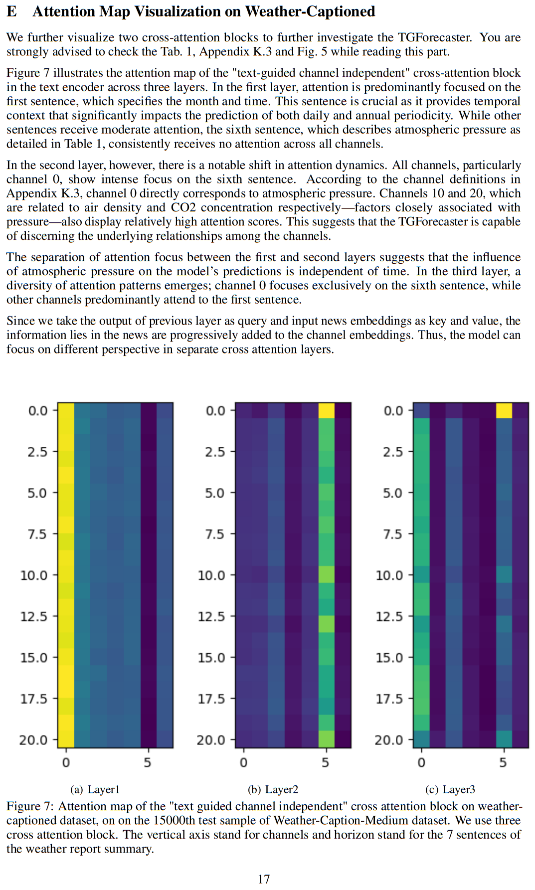

# TGTSF: Text Guided Time Series Forecasting

We only provide the toy dataset for the demo. The real dataset is too large to upload. We will make it available after the review period. 

You may need to do the pre-embedding using scripts provided in the dataset folder. 

The main model is TGTSF_torch. Other versions are deprecated. 

## Additional analysis on of Attention Map

We add the analysis of the attention map here. The Appendix K.3 refer to the J.3 Channel Detail of weather-captioned in the NeruIPS version paper. (Give it several seconds to load the page.)

